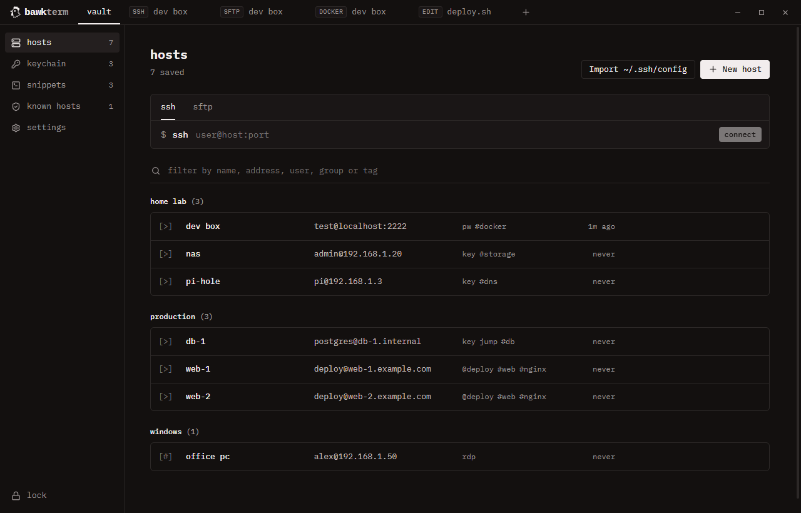
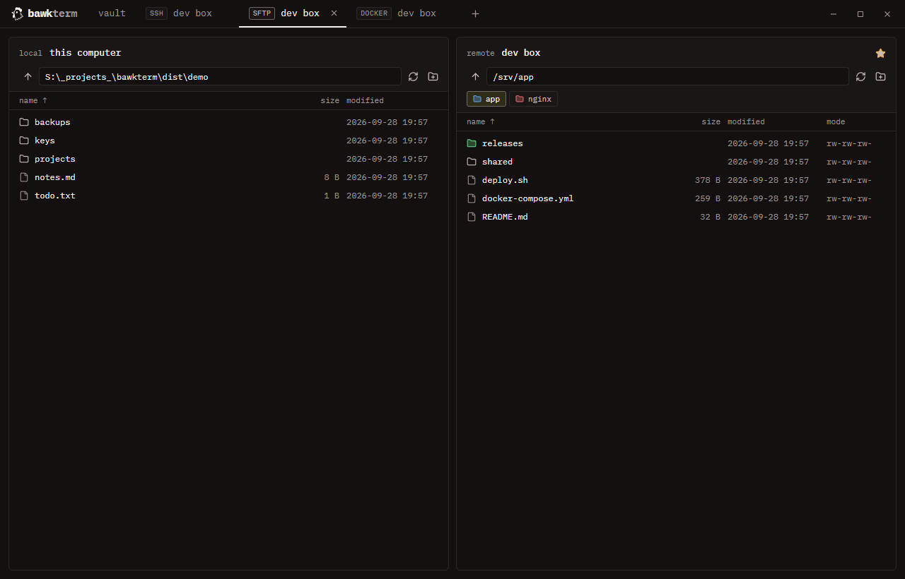
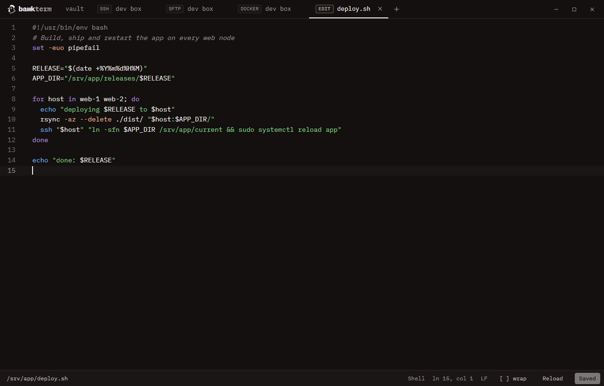
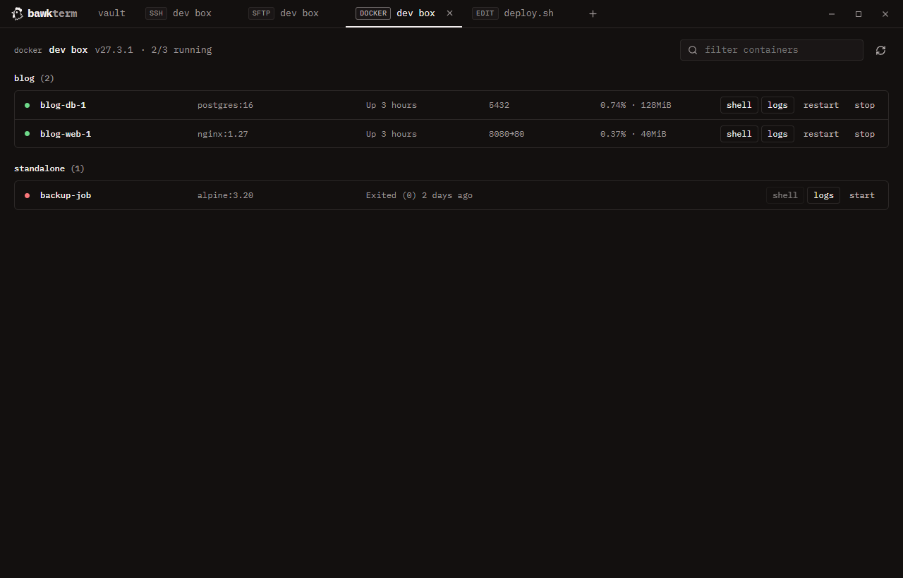

# bawkterm

[](https://github.com/juddisjudd/bawkterm/releases/latest)
[](https://github.com/juddisjudd/bawkterm/releases)
[](https://aur.archlinux.org/packages/bawkterm-bin)

[](LICENSE)

A desktop client for SSH, SFTP, Docker over SSH and Remote Desktop, on Windows, macOS and Linux. It keeps your hosts, passwords and keys in an encrypted vault, and can sync them between your devices, end-to-end encrypted, through [bawksync](https://github.com/juddisjudd/bawksync).

Built with Electron, Svelte 5 and [ssh2](https://github.com/mscdex/ssh2). Styled after [opencode.ai](https://opencode.ai).

> Status: a personal project. Expect rough edges.



## Features

- **SSH terminal**: tabs with WebGL rendering, split panes (side by side or stacked, mixing SSH, SFTP and Docker) with broadcast input to type into every terminal of a tab at once, jump hosts (chained), agent auth (OpenSSH agent and Pageant, including FIDO2 security keys such as a YubiKey), keyboard-interactive and key auth, auto-reconnect, a per-host startup command, paste protection, scrollback search, per-tab zoom, 31 themes including the Black & Gems, Monokai and Coffee variants of [Bearded Theme](https://github.com/BeardedBear/bearded-theme) (the app's colors can match the terminal's), colors, font and cursor imported from Windows Terminal, Alacritty, Ghostty, Kitty, WezTerm, iTerm2 or Warp, tabs reopened on launch.
- **SFTP**: side-by-side local and remote panes, drag and drop (also from Explorer), recursive transfers with Replace / Keep both / Skip, type-to-filter, favorite folders and folder colors per host, "Open terminal here".
- **Built-in editor**: "Edit in editor" opens remote files in a tab with syntax highlighting for about 100 languages, search, and Ctrl+S (Cmd+S on macOS) to save back. You can pick VS Code, another installed editor or any program instead.
- **Keychain**: generate ed25519, RSA and ECDSA keys; import OpenSSH, PEM and PuTTY keys; reusable identities (username plus password or key); import hosts from `~/.ssh/config`.
- **Docker over SSH**: containers per host grouped by Compose project, CPU and memory, start / stop / restart, a shell or live logs in a terminal tab.
- **Remote Desktop hosts**: opens Windows Remote Desktop (or FreeRDP 3 on macOS and Linux) already signed in, optionally through an SSH jump host.
- **Snippets**: saved commands you run from Ctrl+Shift+S (Cmd+Shift+S on macOS).
- **Unlock options**: master password, plus optional Windows Hello, a passkey (phone, security key or this PC) or auto-unlock through Windows DPAPI, the macOS Keychain or the Linux keyring.
- **Sync**: through a bawksync server you run yourself ([self-hosting guide](https://github.com/juddisjudd/bawksync/blob/main/docs/Home.md)). Everything is encrypted on your device first.

| SFTP with favorites and folder colors | Built-in editor | Docker over SSH |
| --- | --- | --- |
|  |  |  |

## Install

Everything is on the [Releases](https://github.com/juddisjudd/bawkterm/releases) page. `SHA256SUMS.txt` there lists a checksum for every file.

**Updates:** the Windows installer, the AppImage, the `.deb` and the `.rpm` update themselves. bawkterm checks GitHub releases on start and every 6 hours, downloads the new version in the background, and shows **update to vX.Y.Z** in the sidebar when it's ready. Turn this off, or check by hand, under **settings → updates**. The Flatpak and the AUR package are updated by `flatpak update` and your AUR helper instead. The macOS app does not update itself yet (see below).

### Windows

Download `bawkterm-<version>-setup.exe` and run it. The installer is not code-signed yet, so Windows SmartScreen asks once: **More info → Run anyway**.

### macOS

Download `bawkterm-<version>-arm64.dmg` for Apple silicon (M1 and newer) or `bawkterm-<version>-x64.dmg` for Intel. Open it and drag bawkterm to Applications.

The app is not signed with an Apple Developer ID yet, so macOS blocks the first launch. To allow it once:

1. Open bawkterm. macOS says it cannot verify the app. Click **Done**.
2. Open **System Settings → Privacy & Security**, scroll down and click **Open Anyway** next to bawkterm.

Or run `xattr -dr com.apple.quarantine /Applications/bawkterm.app` in Terminal.

macOS notes:

- **Updates are manual.** macOS only lets signed apps replace themselves, so download each new version from Releases and drag it over the old one.
- **Auto-unlock** keeps the vault key in the macOS Keychain. After each update, macOS asks again whether bawkterm may use it: click **Always Allow**.
- **Remote Desktop hosts** need FreeRDP 3: `brew install freerdp`.
- **Edit in editor** finds VS Code, Cursor, Zed, Sublime Text, BBEdit and similar apps in Applications, and falls back to TextEdit.
- Shortcuts use Cmd where Windows and Linux use Ctrl. See [Shortcuts](#shortcuts).
- Passkey unlock is Windows-only for now.

### Linux (x64)

| Distribution | File | Install |
| --- | --- | --- |
| Debian, Ubuntu, Mint, Pop!_OS | `bawkterm_<version>_amd64.deb` | `sudo apt install ./bawkterm_<version>_amd64.deb` |
| Fedora, RHEL, openSUSE | `bawkterm-<version>.x86_64.rpm` | `sudo dnf install ./bawkterm-<version>.x86_64.rpm` |
| Arch, Manjaro, EndeavourOS | [`bawkterm-bin`](https://aur.archlinux.org/packages/bawkterm-bin) on the AUR | `yay -S bawkterm-bin` |
| Any (Flatpak) | `bawkterm-<version>-x86_64.flatpak` | `flatpak install --user ./bawkterm-<version>-x86_64.flatpak` (needs the Flathub remote for its runtime) |
| Any (portable) | `bawkterm-<version>.AppImage` | `chmod +x` it and run it |

Linux notes:

- **AppImage on Ubuntu 24.04 and newer:** Ubuntu restricts the kernel feature Chromium's sandbox needs. The AppImage then starts *without* the sandbox, so you lose one layer of protection. Prefer the `.deb` or `.rpm`: their install adds an AppArmor rule so the sandbox works. To keep the sandbox for the AppImage, save this as `/etc/apparmor.d/bawkterm` (adjust the path), then run `sudo apparmor_parser -r /etc/apparmor.d/bawkterm`:

  ```
  abi <abi/4.0>,
  include <tunables/global>
  profile bawkterm /home/*/Applications/bawkterm*.AppImage flags=(unconfined) {
    userns,
    include if exists <local/bawkterm>
  }
  ```
- **Auto-unlock** needs a keyring: GNOME Keyring or KWallet, which most desktops include. Without one, bawkterm does not offer auto-unlock, because Electron would fall back to a key that protects nothing.
- **Remote Desktop hosts** need FreeRDP 3: `sudo apt install freerdp3-x11` on Ubuntu 24.04 (plain `xfreerdp` there is the older FreeRDP 2), the `freerdp` package on Fedora and Arch. bawkterm passes the password through a private pipe, never on the command line. Server certificates are trusted on first use.
- **The Flatpak** runs sandboxed. It can reach your home folder, the network, your keyring and your SSH agent, but it cannot start programs outside the sandbox. External editors and Remote Desktop therefore don't work there; the built-in editor does.
- Windows Hello and passkey unlock are Windows-only for now. On Linux, the vault locks when the computer goes to sleep (Electron cannot detect a locked screen there).

## Security model

bawkterm holds the keys to your servers. To report a security problem, see [SECURITY.md](SECURITY.md).

### The vault

- Everything you save (hosts, passwords, private keys, identities, snippets, trusted host keys) lives in one file, encrypted with **AES-256-GCM** under a random 256-bit **vault key**. The file is `%APPDATA%\bawkterm\vault.json` on Windows, `~/Library/Application Support/bawkterm/vault.json` on macOS and `~/.config/bawkterm/vault.json` on Linux.
- Your master password never encrypts data directly. **scrypt** (N=2^17, r=8, p=1, random salt) turns it into a key that wraps the vault key. Nothing stores or logs the password.
- Every other unlock method keeps its own wrapped copy of the vault key, bound to that method:
  - **Windows Hello**: a Hello key held by Windows (TPM-backed where the PC has a TPM) signs a fixed challenge, and the signature derives the wrapping key. Turning Hello off deletes the Hello key itself.
  - **Passkey**: the WebAuthn PRF extension with a random salt and user verification.
  - **Auto-unlock**: Windows DPAPI, or the Secret Service keyring (GNOME Keyring, KWallet) on Linux. Anyone signed in to your account can then open the vault, and the settings screen says so.
- **Changing the master password creates a new vault key.** Older copies and backups of the vault stop opening, and Windows Hello and passkey unlock are turned off until you set them up again.
- Adding an unlock method, turning on auto-unlock, revealing a saved password and copying the sync link all ask for the master password again.
- Writes are atomic (temp file, flush, rename). The previous version is kept as an encrypted `vault.json.bak`.
- The vault locks after an idle timeout (30 minutes by default), when Windows locks or sleeps, and on Ctrl+Shift+L (Cmd+Shift+L on macOS).

### Inside the app

- Decrypted secrets stay in the main process. The window only learns that a password or key *exists*. Revealing a saved password needs the master password.
- Every request from the window to the main process has its arguments checked, and requests from anywhere but the app's own page are refused.
- Electron is locked down:
  - Sandboxed renderer with context isolation and no Node access.
  - A strict content security policy. No remote content is ever loaded, and navigation is blocked.
  - Only clipboard and notification permissions are granted.
  - The installed app has its Electron fuses set (no running as plain Node, no `NODE_OPTIONS`, no inspector, asar integrity check), no dev tools, and it refuses to start with debugging flags.
- System tools (`powershell`, `cmdkey`, `mstsc`, `reg`, Notepad) are run by full path, and other programs are looked up on `PATH` without the working folder, so a same-named program there is never picked up.

### Talking to servers

- **Host keys**: trust on first use with SHA256 fingerprints. A changed key, or a key of a different type than the one you trusted, blocks the connection with a warning that has **Cancel** selected. Jump hosts are checked too.
- **SFTP downloads**: remote file names are made safe for Windows before anything is written. A server cannot write outside the folder you chose, overwrite device names or follow symlinked folders. Reads have size limits that a server cannot bypass.
- **Edit in editor**: temp copies are marked as downloaded from the internet and deleted when you lock, quit or next start. "Windows default app" only opens text types; anything that could run goes to Notepad.
- **Remote Desktop**: on Windows, the password goes to the Windows credential store through a private pipe, never on a command line. It lasts only for your Windows session and is deleted after launch. On Linux, FreeRDP receives it through its standard input.
- **Clipboard**: remote programs can copy to your clipboard (OSC 52) only if you turn that on, and only from the tab in front, and you see a notice each time. They can never read it. Links in the terminal open on Ctrl+click (Cmd+click on macOS).
- **Updates**: downloaded over HTTPS from this repository's GitHub releases, and installed only if the file matches the SHA-512 checksum published with the release.

### Sync

- Each item is encrypted on your device with AES-256-GCM, and padded to whole KiB. The server stores an opaque record ID (an HMAC of the item ID), a timestamp and the ciphertext. It never sees names, addresses, usernames, passwords or keys.
- The server cannot read or forge items. What else a hostile server can and cannot do:
  - It cannot make you delete one: deletions are decided inside the encrypted data.
  - It cannot bring back a deleted item by replaying an old copy: devices remember deletions.
  - It can refuse service or lose data. Your devices keep their local copies.
- Plain `http://` is only allowed to private IP addresses and `localhost`.
- The sync link contains the server token and the encryption key. Anyone who has it can read your vault. Copying it asks for the master password, and it is cleared from the clipboard after a minute. Joining with a link warns you that everything on the device will be uploaded.
- Anyone with the token can erase the server copy and start over with a new key ("Set up new sync" offers this when the server already holds data). Devices that still sync with the old key see an encrypted marker they cannot open, report that sync was reset, and upload nothing more.

### What bawkterm does not protect against

- **Malware running as your user account.** It can read the app's memory while the vault is unlocked, log your keystrokes, or use auto-unlock if you turned it on.
- **Open sessions while locked.** Locking hides everything and requires unlocking, but SSH and SFTP sessions stay connected.
- **A leaked sync link or server token.** Treat them like passwords. To rotate them, set up sync again with a new token.
- **Losing every device and the sync link.** The server cannot read your data, so it cannot give it back. bawkterm asks you to save the sync link when you set up sync; keep it in a password manager.
- **A hijacked release.** Builds are not code-signed yet, so the updater trusts whatever this repository's GitHub releases contain. Someone who took over the maintainer's GitHub account could publish a malicious update.
- **Forks sharing the passkey site name.** Passkeys are tied to `bawkterm.bawkbawk.net` (the app serves itself from that name locally, without network access). Forks should change `APP_HOST` in `src/main/index.ts`.

## Build from source

Needs [Bun](https://bun.sh) 1.4+ and Node 24+ (Electron's tooling runs on Node).

```sh
bun install
bun run dev          # hot-reload dev build
bun run build        # production build into out/
bun run dist         # installers for this platform into dist/
bun run dist:win     # Windows installer
bun run dist:linux   # AppImage, deb, rpm, tar.gz and Flatpak (run on Linux)
bun run dist:mac     # Apple silicon and Intel .dmg (run on macOS)
bun run typecheck
```

`bunfig.toml` only installs package versions that have been public for at least a day. That gives the registry time to pull a hijacked release before it reaches this project.

Try it without a real server:

```sh
bun run test-server  # SSH + SFTP on 127.0.0.1:2222, login test / test
```

Building the Flatpak needs `flatpak` and `flatpak-builder` installed, and the Flathub remote added (`flatpak remote-add --user --if-not-exists flathub https://dl.flathub.org/repo/flathub.flatpakrepo`). Building the `.rpm` needs `rpm`.

Dev builds (not the installed app) accept `BAWKTERM_DATA_DIR` to keep a separate vault while testing.

## Releases

```sh
bun run release patch   # or minor, major, or an exact x.y.z
```

The script refuses a dirty tree or a branch other than `main`. It bumps `package.json`, commits, tags `vX.Y.Z` and pushes. The tag runs `.github/workflows/release.yml`, which:

1. Typechecks.
2. Builds the Windows installer, every Linux package and the macOS disk images in parallel.
3. Publishes one GitHub Release with all files, `SHA256SUMS.txt` and notes from the commits since the last tag.
4. Updates the AUR package, if an AUR key is configured (see [packaging/aur](packaging/aur/README.md)).

## Shortcuts

| Windows and Linux | macOS | Action |
| --- | --- | --- |
| Ctrl+Shift+P | Cmd+Shift+P | open host / quick connect (`user@host:port`); Shift+Enter opens SFTP |
| Ctrl+Shift+S | Cmd+Shift+S | run a snippet in the terminal |
| Ctrl+Shift+F | Cmd+F | search terminal output |
| Ctrl+= / Ctrl+- / Ctrl+0 | Cmd+= / Cmd+- / Cmd+0 | zoom terminal text in, out, reset |
| Ctrl+Tab | Ctrl+Tab | next tab |
| Ctrl+Shift+W | Cmd+W | close tab or pane |
| Ctrl+Shift+D | Cmd+D | split right |
| Ctrl+Shift+E | Cmd+Shift+D | split down |
| Ctrl+Alt+arrows | Cmd+Option+arrows | move between panes |
| Ctrl+Shift+C / V | Cmd+C / V | copy / paste in terminal (right click also copies or pastes) |
| Ctrl+Shift+L | Cmd+Shift+L | lock vault |
| Ctrl+click | Cmd+click | open a link in the terminal |

## Project layout

```
src/main       vault, unlock methods, SSH/SFTP/Docker/RDP, sync, IPC (Node side)
src/preload    typed bridge exposed as window.api
src/renderer   Svelte UI
src/shared     types and defaults shared by both sides
scripts        test SSH server, release script, icon generator (bun run icon)
packaging      AUR package template
build          app icons generated from src/renderer/src/assets/chicken.svg
```

## Forking

Change these to your own values: `APP_HOST` in `src/main/index.ts`, the default sync address in `src/renderer/src/lib/components/SyncSettings.svelte`, and `appId` in `electron-builder.yml`.

## License

[GNU Affero General Public License v3.0](LICENSE). You may use, change and share bawkterm, and anyone who distributes a changed version must publish its source under the same license.
